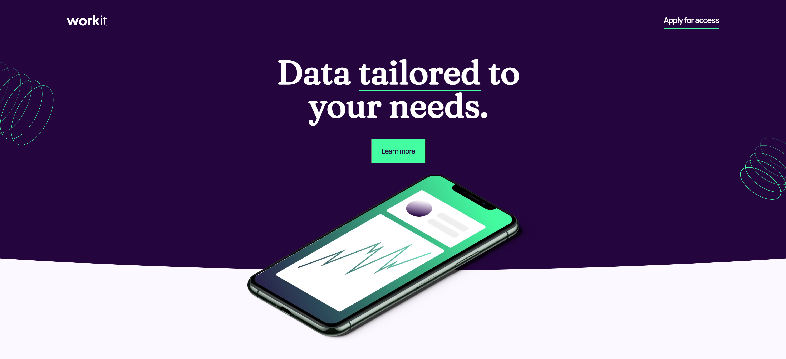

# Frontend Mentor - Results summary component solution

This is a solution to the [Results summary component challenge on Frontend Mentor](https://www.frontendmentor.io/challenges/results-summary-component-CE_K6s0maV). Frontend Mentor challenges help you improve your coding skills by building realistic projects. 

## Table of contents

- [Overview](#overview)
  - [The challenge](#the-challenge)
  - [Screenshot](#screenshot)
  - [Links](#links)
- [My process](#my-process)
  - [Built with](#built-with)
  - [What I learned](#what-i-learned)
  - [Continued development](#continued-development)
  - [Useful resources](#useful-resources)
- [Author](#author)
- [Acknowledgments](#acknowledgments)

**Note: Delete this note and update the table of contents based on what sections you keep.**

## Overview

### The challenge

Users should be able to:

- View the optimal layout for the interface depending on their device's screen size
- See hover and focus states for all interactive elements on the page

### Screenshot



### Links

- Solution URL: [Solution](https://github.com/fikaa73/fikaa73.github.io/workit-landing-page)
- Live Site URL: [Live](https://fikaa73.github.io/workit-landing-page)

## My process

### Built with

- Semantic HTML5 markup
- CSS custom properties
- Flexbox
- CSS Grid

**Note: These are just examples. Delete this note and replace the list above with your own choices**

### What I learned

This project helped me a lot to learn about custom positioning elements on page, and to confirm my flex box knowledge.

```css
.header::before {
    content: "";
    position: absolute;
    z-index: -1;
    top: 0;
    bottom: 0;
    right: 0;
    left: 0;
    background: var(--dark-purple);
    clip-path: ellipse(170% 100% at 50% 0);
}
```
I have no idea how this thing works actually, but it's working great :)

### Continued development

I should really take a look on the clip-path and similar things. They can really come useful sometimes.

### Useful resources

- [PRINCEKK122 GitHub Repo](https://github.com/PRINCEKK122/work-it-landing-page) - Gave me an idea for ellipse background in header.

## Author

- Frontend Mentor - [@fikaa73](https://www.frontendmentor.io/profile/fikaa73)
- E-mail - [fvukotic@gmail.com](mailto:fvukotic@gmail.com)


## Acknowledgments

Many thanks to PRINCEKK122 again for giving me an idea about curving div background.

